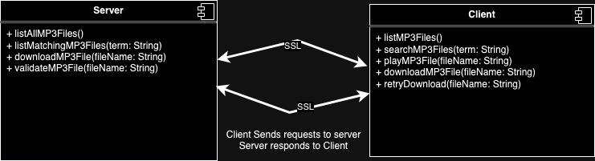

# CS469, Group 1, Project

## Proposal
Members: Corey Brantley, Shen Knoll, Harrison Sherwin

"Build a media server that stores MP3 audio files that can be downloaded and played by a client. The server process should be replicated to provide fault tolerance, but the data does not need to be for this project. The client should be able to request a listing of available audio files then choose one to download. The client must be authenticated using cryptographic methods."

The server code will be packaged as a Docker container image to implement virtualization and require less installation for the user. Containerization will allow for easier access to fault tolerance as a multiple servers can run on one or more nodes with the help of a container orchestration system like Kubernetes (K8s). Further, the client code will not quit when playback ceases; nor will the server quit after a single file is downloaded. Both will only quit on a fatal error or by user direction.  SSL over TCP will be used to provide some authentication and security between client and server. A Kubernetes Service will be used to distribute traffic across different server containers to achieve transparency. The client will need to accomodate for this by establishing TCP over SSL sessions with each call. The complete package will be provided as a Kubernetes manifest file for ease of server setup.Hashes will be available server-side of each available MP3 file to allow for data validation by clients.

Clients will implement a retry algorithm if downloads are corrupt or failed. Clients will use the libmpg123 and libao C libraries to decode and playback MP3 files. Clients will cache the current MP3 file.

Servers will store MP3 files at this time. An obvious improvement would be storing MP3 files inside something like Amazon S3 and having the client utilize the AWS S3 SDK; however, the would circumvent the assignement. Server containers will run with a heightened, non-default Kubernetes security context to prevent an attacker from escalating privledges.  The server will expect at least 3 container instances to achieve replication. Consistency can be maintained with the use of a Kubernetes maximum pod lifetime and update strategy.

Servers will support the following actions from the client:
1) List all MP3 files available.
2) List all MP3 files available matching a search term.
3) Download a MP3 file.
4) Validate a MP3 file (download it's hash).

Clients will support the following actions from the user:
1) List MP3 files available.
2) Search for MP3 files.
3) Play a MP3 file.

Source of inspiration for playing back MP3 files: https://hzqtc.github.io/2012/05/play-mp3-with-libmpg123-and-libao.html

High Level Architecture Diagram:
Client > K8s Service (Load Balancer Type) > Replicated Server Containers

The K8s service and containers will run on nodes of the Kubernetes cluster. Kubernetes cluster architecture is explained here: https://kubernetes.io/docs/concepts/architecture/

UML Diagram:

## How to Run the Server
Options, from lowest to highest level:
- Build it from the source code yourself. The files' purposes are listed above. You can even use our Makefile.
- Use our executable in the executables/ folder.
- Consume the Docker Image as a .tar file.
- Consume the Docker Image yourself from Dockerhub. It's available at: hsherwin/cs469-server:latest
- Download and apply k8s-manifest-no-helm.yaml to your own K8s cluster: kubectl apply -f k8s-manifest-no-helm.yaml
- Download and install the Helm chart to your own K8s cluster: helm upgrade --install server-release ./server-helm-chart

## How to Run the Client
Options, from lowest to highest level:
- Build it from the source code yourself. The files' purposes are listed above. You can even use our Makefile.
- Use our executable in the executables/ folder.

## Supported Client Operations:
When launching a menu will be presented to the user with all options:
- List available MP3s to download
- Search MP3s to download
- Download MP3
- Play MP3
- Stop MP3
- Stop Program

## Sample Simple Step by Step Execution
1. Download everything from GitHub as a ZIP.
2. Unpackage the ZIP archive.
3. If you're on GUI, open a command prompt/terminal to the directory you just created by unzipping.
4. Make you already have Docker CLI and Docker Engine installed: https://docs.docker.com/engine/install/
5. Make sure you have the needed libraries installed by running: sudo apt-get install -y libmpg123-dev libao-dev
6. Make the executables by running (you really just need the client, but this is easier to use our Makefile): make
7. Start the server container (this command will also download the container image from DockerHub): docker run -d --name music-server -p 8080:8080 -e PORT=8080 hsherwin/cs469-server:latest
7a. Make sure the container is running by running: docker inspect --format='{{.State.Status}}' music-server
7b. If "running" is returned, proceed. If not, troubleshoot.
8. Get the server IP address: SERVER_IP=$(docker inspect -f '{{range.NetworkSettings.Networks}}{{.IPAddress}}{{end}}' music-server)
9. Run the client: ./client $SERVER_IP:8080
10. Type "1" to get a list of songs.
11. Type "3" to download a song.
12. Type "Sprouts.mp3" as the song to download.
13. Type "4" to play a song.
14. Type "1" to play your only downloaded song.
15. Type "5" to stop the song.
16. Type "2" to search for a song.
17. Type "flow" to see a searchable song.
18. Type "0" to exit the client.
19. To stop the server container, run: docker stop music-server
20. To remove the server container, run: docker rm music-server
21. To remove the server container image, run: docker rmi hsherwin/cs469-server:latest
22. You can proceed to delete any other files or installs from prior steps as normal.
15. Type "2" to search for a song.

## File & Folder Descriptions
- .github/workflows/ - Test and Artifact Creation scripts for GitHub Actions.
- diagrams/ - UML Diagrams for Proposal.
- downloaded-mp3s/ - Dev resource. Do not use.
- sample-mp3s/ - The MP3s files we're hosting. All royalty free of course.
- server-helm-chart/ - Provides the files needed to deploy the server application on Kubernetes as as a Helm chart. See: https://helm.sh/docs/
- .gitignore - Ignore this. ;)
- CommunicationConstants.h - Defines constants to be used in communication between Server and Client.
- Dockerfile - Used to containerize the server code.
- Makefile - Used to compile C code above.
- README.md - This text.
- client.c - Client code in C language.
- k8s-manifest-no-helm.yaml - Used to describe how to run the server container with Kubernetes. A Kubernetes manifest to deploy the server with no addons used. See: https://kubernetes.io/docs/concepts/workloads/management/
- playaudio.c - A component of the client code in C language.
- playaudio.h - A component of the client code in C language.
- server-image.tar - A .tar version of the server Docker image.
- server.c - Server code in C language.

## Networking Tips
Everything we created defaults to port 8080. To change it, you have options (from lowest to highest level):
-  The source code default is in CommunicationConstants.h.
- The executables will accept other ports as an argument.
- The Dockerfile supports argument "PORT" which is passed to the executables.
- The no-Helm manifest file is best changed with a replace all of "8080" to your port of choice. This is passed to container as an environment variable.
- The Helm Chart stores the port in server-helm-chart/values.yaml/networking/containerPort. This is passed to container as an environment variable.

Keep in mind if you're going "custom" that the port is used in all of these locations:
- The Kubernetes Service has two port configurations (For Helm, defined in values.yaml).
- The Kubernetes Deployment env, containerPort, and both probes (For Helm, defined in values.yaml).
- - env is passed to the container runtime, see next bullet.
- The Dockerfile ARG, EXPOSE and CMD instructions.
- - CMD is passed to the server executable, see below.
- The server executable (which can get it as an argument or default to the value in CommunicationConstants.h).
- The client executable (which can get it as an argument or default to the value in CommunicationConstants.h).